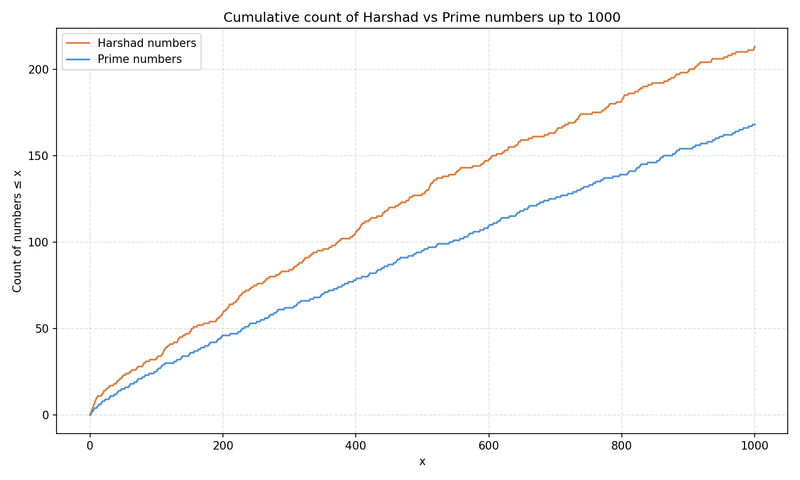

# generate numbers

Generate all numbers of a type (e.g. prime, harshad) between 0 and 10^N.

## overview

| Type    | Description                                               |
| ------- | --------------------------------------------------------- |
| prime   | Numbers that can only be divided by 1 and itself.         |
| harshad | Numbers that are divisible by the sum of its own numbers. |

## instructions

Below are the instructions for linux. If you don't have linux, install it, it's better. If you don't want to, you can always install WSL on Windows and if you're a MacOS user, my condolences.

### install (linux)

Install swipl:
```sh
sudo apt install swipl
```
(for non-Debian distributions, figure it out yourself, you did this to yourself)

Compile binary:
```sh
make build
```

### usage (linux)

```sh
$ ./generate_numbers -h
Usage: ./generate_numbers [-h] -t <type> [-m <mode>] [-n <N>] [-o <file>]
  Flags:
    -h  Show this help message
    -t  The type of number to generate:
          prime   -- Numbers that can only be divided by 1 and itself
          harshad -- Numbers that are divisible by the sum of its own numbers
    -m  Runs a specific mode, the modes are:
          default -- prints all numbers and the total amount, this is the default (wow, unexpected)
          list    -- prints only the numbers
          amount  -- prints only the amount of numbers
    -n  Generate numbers between 0 and 10^<N>, default is 1
    -o  Write output to <file> instead of stdout
  Note: the order of the flags doesn't matter

```

### Make targets

| Target  | Description         |
| ------- | ------------------- |
| `all`   | `build` + `test`    |
| `build` | compiles the binary |
| `test`  | runs the tests      |

### plot

I quickly generated a script with AI to generate plots like this one:



You can run it with:

```sh
python3 plot.py [N]
```

THe N is the same as the one in the `generate_numbers` binary.